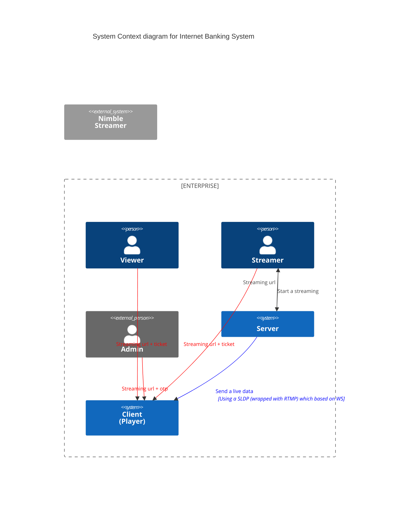
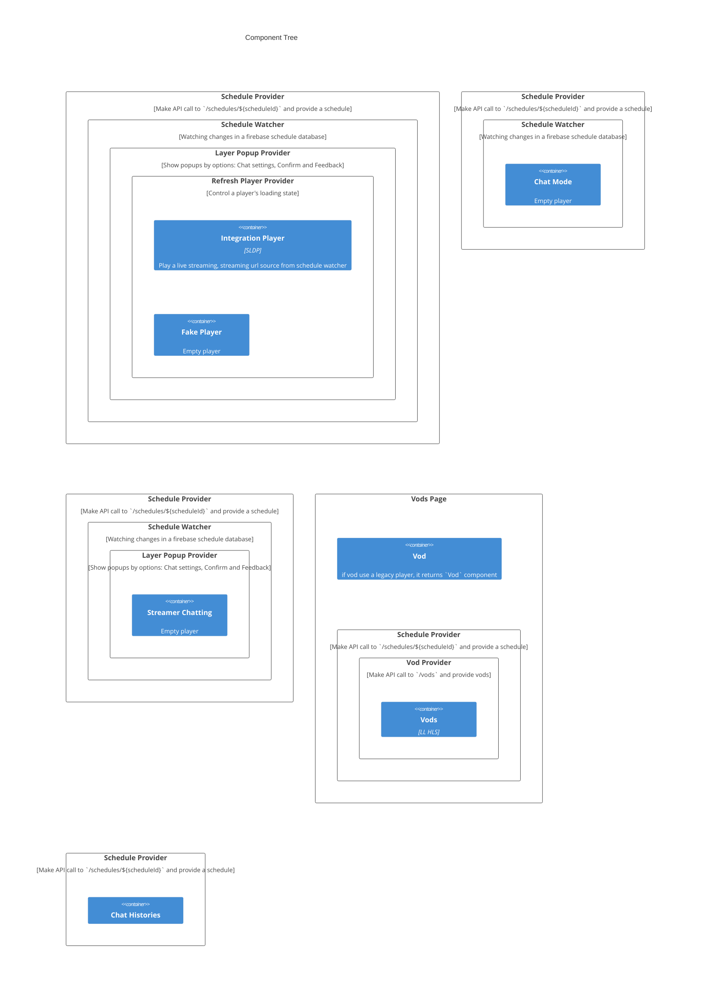

| Author        | your name   |
| ------------- | ----------- |
| Created       | Jan 1, 1970 |
| Last modified | Jan 1, 1970 |

### Technical vision

- the main goal of this project.
- Set of guidelines and principles for the team or entire organization (e.g., testing best practices, Redux shape vision, applying feature-sliced design, etc)
- Summary of decisions being made
- Definition of the processes (e.g., on-call rotations, addressing technical debt, etc)

### Technical strategy

- details the concrete steps and challenges required to get there.

### Motivation

- should provide a brief overview of the problem that the feature or project is aiming to solve. It should focus on the “what” rather than the “how”. It is important to include enough information in this section for the readers to evaluate the feasibility of the proposed solution.

### Design proposal

- outlines the approach and methodology for achieving the goals mentioned in the motivation section.

### Terminology

- should include any special terms or concepts that are specific to the project and may not be familiar to everyone on the team.

### High level design

- project milestones (e.g., “Build JSON policy editor widget”, “Build cross-region copy flow”, etc)
- for each milestone, define a high-level component tree with state-related concerns (if you are using a state management system like Redux, it might be important to highlight what data goes to the global state vs. what data is isolated in the component’s local state).
- If you are using distributed frontend architecture (micro-frontends), you may apply Domain-Driven Design methodology to draw new boundaries in the architecture. In other words, whether this new feature fits into existing subdomain/bounded context or requires a brand new micro-frontend app to be developed and deployed. If the latter, then how it will communicate with other apps, and what events will represent these communication concerns?
- API integration and permission model: what permissions are required to call specific API, and what would be the UX behaviour in case of lack of permissions (e.g., redirect to page B)
- Known limitations and uncertainties (e.g. “We won’t be able to use ModalA component because it requires admin account permissions to build the view. We will have to wait for Auth team to release delegated admins type of account” or “If we decide to use the same advanced JSON editor as we on PageA, we need to investigate how we can manage shared third-party dependencies in the future”). This kind of considerations can be really useful for engineer who will be working closely on the low-level design for this milestone.
- Define business/operational metrics to track
- Rough estimates for each milestone (preferably, build a workstream diagram that will highlight dependencies between milestones, order of execution and level parallelization)



### Low level designed

<!-- TODO Add a router config -->



- Send, Receive a chat message
    
    ```mermaid
    sequenceDiagram
    	participant Client
      participant Firebase
      Note over Client,Firebase: Send a message
      Client->>Firebase: "messages", message, user key, schedule key
      Note over Client,Firebase: Receive a message
      Firebase->>Client: lastest message
      Client->>Client: invoke 'child_added' event
      Client->>Client: append latest message to messages
    ```
    
- Enter a Live streaming, VOD service
    
    ```mermaid
    sequenceDiagram
        participant Client
        alt from admin
    	    Client->>Server: /account/otp
        else from services (mtv, wow, ...)
    	    Client->>Server: /account/check
        end
        activate Server
        Server-->>Client: receive tokens
        deactivate Server
        Client->>Client: Set Authorization header with access token
        Server->>Client: Streaming Url
        alt VOD
          Client->>Client: Choose vod wms token from cookie
        else Live
          Client->>Client: Choose wms token from cookie
        end
        alt has wms token
    	    Client-->>Client: `${Streaming_Url}?wmsAuthSign=${wms_token}`
        else
    	    Client-->>Client: `${Streaming_Url}`
        end
    ```

- Enhanced component tree with more fine-grained components and well-defined state shapes and component contracts
- If your app requires complex API orchestration, you may benefit from having a detailed flow diagram to highlight the order of API execution and when to update components with new state
- Error handling for special use cases
- Performance concerns, such as caching and network optimization
- Security concerns, such as permission schemas to be publicly shared, storing sensitive information in the local storage/IndexDB, CSRF protection, CSP headers
- Alternative design considerations
- Technologies and tools to be used
- Test scenarios (usually speaking about E2E tests here)
- Accurate estimates of work and level of parallelization

### Risk Considerations

- should address any potential risks associated with the proposed design. This includes having a contingency plan in case the original design does not work, as well as identifying any potential side effects that could impact the existing architecture (e.g. performance, usability concerns)

### Security Considerations

- should address how the proposed solution will handle sensitive data, permissions policies, and protection against both insider and external threats.

### Operations

- The operations section of the design document should address how the system will be operated once it is deployed. This includes business metrics, such as who will use the feature and how it will be used, as well as system health monitoring, such as ensuring that page loads successfully, tracking the latency of user actions, and monitoring web vital metrics.

### Testing Scenario

- should cover all aspects of the business flow, including input validation, error handling, and edge cases.

### Appendices

- typically used to provide additional information that may not be directly relevant to the core design. Examples of information that can be included in the appendix section are non-essential architecture diagrams, UX mockups, code snippets (can be even pseudo-code), links to tools documentation, and other related design documents.
